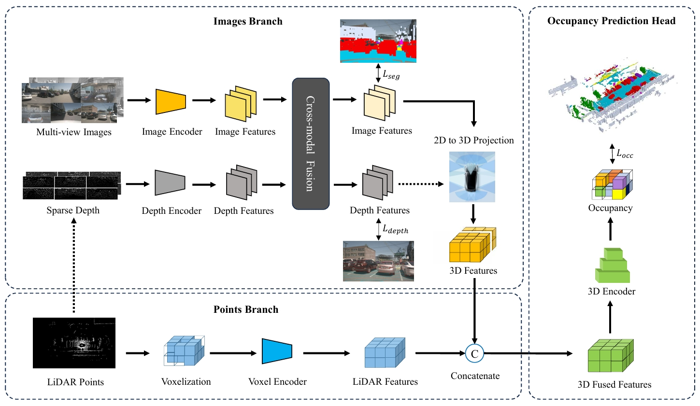

# FusionOcc
> **FusionOcc: Multi-Modal Fusion for 3D Occupancy Prediction, MM 2024** [[paper](https://openreview.net/forum?id=xX66hwZJWa)]

## INTRODUCTION
FusionOcc is a new multi-modal fusion network for 3D occupancy prediction by fusing features of LiDAR point clouds and surround-view images. The model fuses features of these two modals in 2D and 3D space, respectively. Semi-supervised method is utilized to generate dense depth map, which is integrated by BEV images via a cross-modal fusion module. Features of voxelized point clouds are aligned and merged with BEV images' features converted by a view-transformer in 3D space. FusionOcc establishes a new baseline for further research in multi-modal fusion for 3D occupancy prediction, while achieves the new state-of-the-art on Occ3D-nuScenes dataset.



## Getting Started

- [Installation](docs/install.md)

- [Datasets](docs/datasets.md)

- [Train, Eval and Visualize](docs/getting_started.md)

## Model Zoo

| Backbone | Config | Mask | Pretrain | mIoU | Checkpoints | 
| :-------: | :---: | :---: | :---: | :---: | :---: |
| Swin-Base | [Base](configs/) | ✔️ | ImageNet | 35.94 | [BaseMask](checkpoints/) |
| Swin-Base | [Base](configs/) | ✖️ | ImageNet | 56.62 | [BaseWoMask](checkpoints/) |
<!-- | ViT-Tiny | [Light](configs/) | ✔️ |  |  |  |
| ViT-Tiny | [Light](configs/) | ✖️ |  |  |  | -->


## Acknowledgement

Thanks a lot to these excellent open-source projects, our code is based on them:
- [BEVDet](https://github.com/HuangJunJie2017/BEVDet), [BEVFormer](https://github.com/fundamentalvision/BEVFormer), [BEVFusion](https://github.com/mit-han-lab/bevfusion)
- [Occ3d](https://github.com/Tsinghua-MARS-Lab/Occ3D), [CVPR23-Occ-Chanllege](https://github.com/CVPR2023-3D-Occupancy-Prediction)

Some other related projects for Occ3d prediction:
- [SurroundOcc](https://github.com/weiyithu/SurroundOcc), [TPVFormer](https://github.com/wzzheng/TPVFormer)
- [PanoOcc](https://github.com/Robertwyq/PanoOcc), [RenderOcc](https://github.com/pmj110119/RenderOcc)


## BibTeX

If this work is helpful for your research, please consider citing the following paper:

```
@inproceedings{
    zhang2024fusionocc,
    title={FusionOcc: Multi-Modal Fusion for 3D Occupancy Prediction},
    author={Shuo Zhang and Yupeng Zhai and Jilin Mei and Yu Hu},
    booktitle={ACM Multimedia 2024},
    year={2024},
    url={https://openreview.net/forum?id=xX66hwZJWa}
}